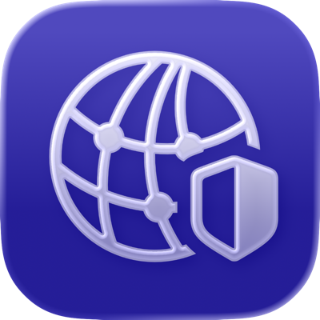

# RelayRace 🌐
### A jailbreak tweak that fixes iCloud Private Relay (Safari, Mail) on iOS 17.0.

RelayRace fixes an iOS 17.0 bug where iCloud Private Relay fails to activate. While the system fetches a config from `mask-api.icloud.com`, it gets rejected by a local security check. By injecting into a prepared copy of the `networkserviceproxy` daemon, RelayRace bypasses this validation failure and allows the patched daemon to route traffic.

---

<p align="center">
  <picture>
    <source media="(prefers-color-scheme: dark)" srcset="RelayRaceIconDark.png">
    
  </picture>
</p>

---

## Compatibility & Installation

I have only seen this issue affect users on iOS/iPadOS 17.0, therefore **RelayRace only supports NathanLR on iOS 17.0.** Also, the bundled `networkserviceproxy` executable was pulled from a device running this version. A userspace reboot is **required** after installation. 

Download the latest version from **[Releases](https://github.com/shalamand3r/RelayRace/releases)** or **[Add my Sileo Repo](https://shalamand3r.github.io)**.

## Using Your Own `networkserviceproxy`

RelayRace includes a prepared `networkserviceproxy` binary that was dumped from an iOS 17.0 device so that the tweak works out of the box. If you would rather use your own copy, dump `networkserviceproxy` from an iOS/iPadOS 17.0 device, patch it locally, and replace the bundled file before building:

```sh
# Replace the bundled binary with your own dumped copy.
cp /path/to/your/networkserviceproxy tools/macprep/networkserviceproxy.ct

# Patch your copy in place.
tools/macprep/relayrace-ct-bypass-mac -i tools/macprep/networkserviceproxy.ct -r

# Build the package with your patched binary.
gmake package
```

The resulting `.deb` will include your own patched binary instead of the one shipped in this repo. Make sure the binary comes from an iOS 17.0 device as otherwise RelayRace may not function.

If you want to build the prep helper from source, see [tools/source/README.md](tools/source/README.md).

---
## Credits
- Lars Fröder (opa334) for ChOma / CoreTrust bypass tooling.
- verygenericname for NathanLR and nathanlr_hooks.
---

<p align="center">
  <a href="https://github.com/shalamand3r/RelayRace/releases">
    
  </a>
</p>
