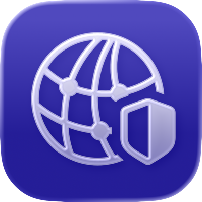

# RelayRace 🌐
### A jailbreak tweak that fixes iCloud Private Relay (Safari, Mail) on iOS.

RelayRace fixes iCloud Private Relay (Safari, Mail) on iOS by patching `networkserviceproxy` so configuration validation can complete normally.

---

<p align="center">
  <picture>
    <source media="(prefers-color-scheme: dark)" srcset="RelayRaceIconDark.png">
    
  </picture>
</p>

---

## Compatibility & Installation

RelayRace targets iOS/iPadOS **17.0 and later** and supports both **Dopamine/rootless full jailbreaks** (native daemon injection) and **NathanLR** (SysBins patched daemon workaround).

> **Untested firmware warning:** Only iOS/iPadOS 17.0 has been tested. Later versions are accepted by the package but remain untested. Use them at your own risk and keep a recovery path available.

* **Dopamine/rootless full jailbreaks (Recommended)**: Uses native daemon injection via ElleKit into the stock running `networkserviceproxy`. No userspace reboot is normally required — installation attempts to restart `networkserviceproxy`.
* **NathanLR**: Automatically stages a bundled, prepared iOS 17.0 `networkserviceproxy` binary into `SysBins` and uses the NathanLR-compatible ElleKit load path. A userspace reboot is required after installation. *(Note: Upgrading to Dopamine is recommended for native injection and improved stability.)*

The same rootless `.deb` contains both library variants and selects the appropriate path during installation. Dopamine stages the native library and its matching filter in ElleKit's canonical `/var/jb/usr/lib/TweakInject` directory; NathanLR receives a separately signed copy there using the legacy absolute ElleKit path and additionally receives the prepared daemon. The installer prints the detected firmware and a warning when later, untested firmware is used.

Removal is also environment-aware. Dopamine/native ElleKit installations unload RelayRace by restarting only `networkserviceproxy`, with no userspace reboot requested. NathanLR removal deletes the prepared SysBins daemon and requests the userspace reboot needed to restore the stock daemon path.

This repository currently builds a rootless package (`Architecture: iphoneos-arm64`). Classic rootful jailbreaks (`iphoneos-arm`) and roothide packages (`THEOS_PACKAGE_SCHEME=roothide`, normally `iphoneos-arm64e`) use different package layouts and metadata, so they require their own package build; this exact `.deb` should not be advertised as universal for those environments. The native library does include Theos’ relocated-jbroot `@rpath` entries for compatible rootless-v2 environments.

Download the latest version from **[Releases](https://github.com/shalamand3r/RelayRace/releases)** or **[Add my Sileo Repo](https://shalamand3r.github.io)**.

## Version 1.1

- Added support for Dopamine 3.

## Using Your Own `networkserviceproxy`

RelayRace includes a prepared `networkserviceproxy` binary that was dumped from an iOS 17.0 device. This binary is used only by the NathanLR fallback; Dopamine uses the stock daemon through ElleKit. If you would rather use your own copy for NathanLR, dump `networkserviceproxy` from the matching iOS/iPadOS firmware, patch it locally, and replace the bundled file before building:

```sh
# Replace the bundled binary with your own dumped copy.
cp /path/to/your/networkserviceproxy tools/macprep/networkserviceproxy.ct

# Patch your daemon copy in place. Do not run this helper on RelayRace.dylib.
tools/macprep/relayrace-ct-bypass-mac -i tools/macprep/networkserviceproxy.ct -r

# Build the package with your patched binary.
make package # cool people use gmake package
```

The resulting `.deb` will include your own patched binary instead of the one shipped in this repo. A matching daemon from the target firmware is recommended; later firmware combinations are untested and may not function. The native Dopamine dylib is signed with `ldid`; the separate NathanLR dylib follows the legacy `ldid` plus CoreTrust-preparation sequence used by the known-working preloaded-daemon package.

If you want to build the prep helper from source, see [tools/source/README.md](tools/source/README.md).

## Diagnostics

RelayRace emits a small number of runtime status messages to Apple's rotating unified log. It does not create persistent diagnostic files. The messages record whether the dylib loaded into `networkserviceproxy` and whether the bypass methods were patched.

From a terminal, you can watch the unified log with:

```sh
log stream --level info --predicate 'subsystem == "com.shalamand3r.relayrace" OR process == "networkserviceproxy"'
```

You can also connect the device to a Mac, select it in Console, start streaming, and search for `com.shalamand3r.relayrace`.

---
## Credits
- Lars Fröder (opa334) for ChOma / CoreTrust bypass tooling.
- verygenericname for NathanLR and nathanlr_hooks.
---

<p align="center">
  <a href="https://github.com/shalamand3r/RelayRace/releases">
    
  </a>
</p>
